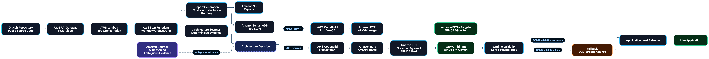
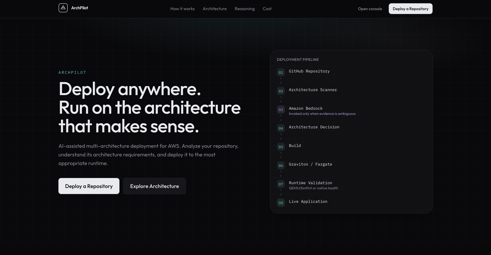
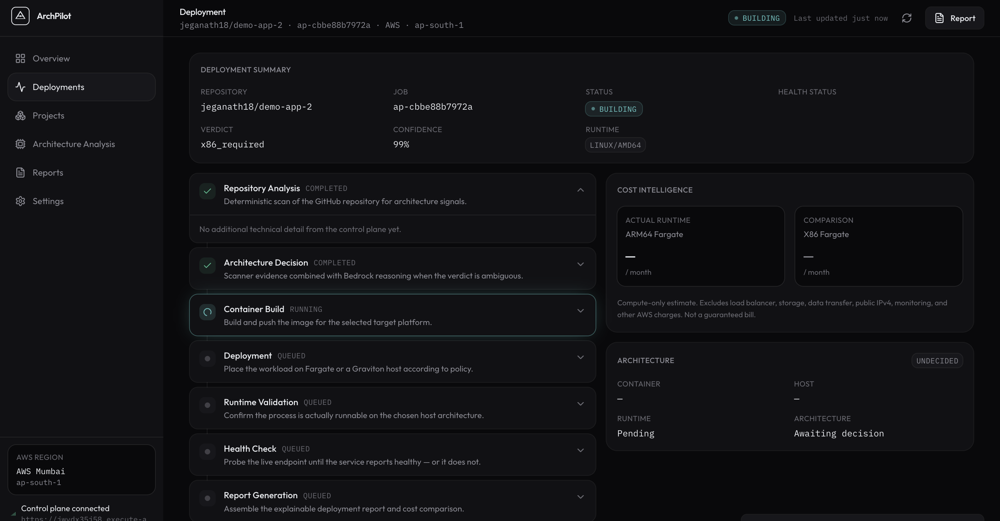
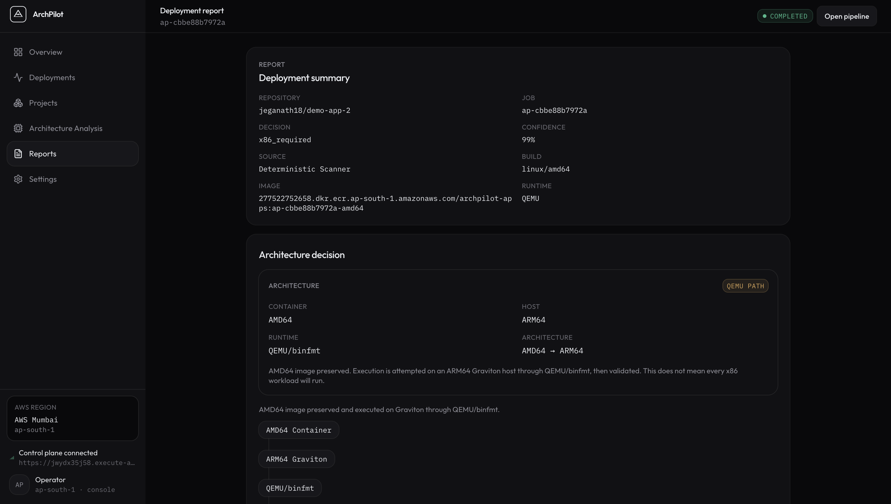
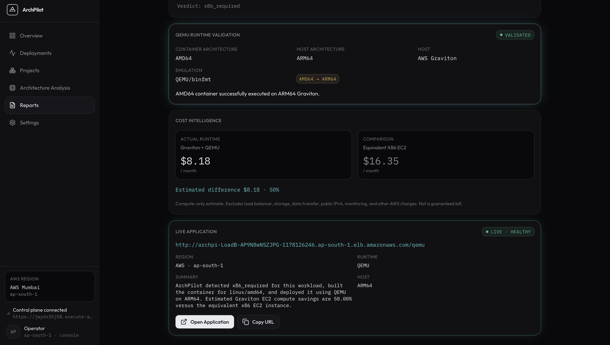

<div align="center">

# 🚀 ArchPilot

### AI-Assisted Multi-Architecture Deployment Platform for AWS Graviton

[](LICENSE)
[](https://aws.amazon.com)
[](https://aws.amazon.com/bedrock/)
[](https://aws.amazon.com/fargate/)
[](https://wemakedevs.org)

**Paste a GitHub URL. Get a Graviton-powered live deployment in minutes.**

[🌐 Live App](https://main.d2rl802d2nx5lh.amplifyapp.com/) • [📦 Backend Repo](https://github.com/jeganath18/arch-pilot) • [🎥 Demo Video](#) 

</div>

---

## 🧩 The Problem

Developers default to x86 — not because it's better, but because switching to ARM64 (AWS Graviton) feels risky and complex.

| Pain Point | Reality |
|---|---|
| *"Will my dependencies work on ARM64?"* | Most do — but nobody checks |
| *"Multi-arch Docker builds are complicated"* | They are, without tooling |
| *"Is Graviton actually cheaper?"* | Up to **40% cheaper** — but hard to verify |
| *"How do I explain the decision to my team?"* | No explainability = no trust |

**ArchPilot solves all four.** Automatically.

---

## ✅ The Solution

ArchPilot is a fully serverless pipeline that takes any **public GitHub repository**, determines its **ARM64 compatibility**, builds a **multi-architecture Docker image**, and deploys it **live on AWS Graviton** — with a transparent decision report and real cost savings estimate.

```
Paste GitHub URL  →  AI Analysis  →  Multi-arch Build  →  Live on Graviton  →  Cost Report
       (5 sec)          (15 sec)         (2–3 min)           (instant)           (always)
```

---

## 🏗️ Architecture

<!-- 📸 ARCHITECTURE DIAGRAM
     Replace the image below with your architecture diagram.
     Recommended: export from draw.io, Lucidchart, or AWS Architecture Tool.
     Save as: docs/images/architecture.png
     Ideal size: 1200×700px, transparent or white background -->



> **Image description:** The diagram above shows the full end-to-end pipeline from GitHub URL submission to live Graviton deployment. ASCII version below for quick reference.

---

```
┌─────────────────────────────────────────────────────────────┐
│                        User Browser                         │
│                  AWS Amplify — Frontend                     │
└────────────────────────────┬────────────────────────────────┘
                             │ HTTPS
                             ▼
                  ┌──────────────────────┐
                  │   Amazon API Gateway │
                  │      REST API        │
                  └──────────┬───────────┘
                             │
                             ▼
                  ┌──────────────────────┐
                  │   AWS Step Functions │
                  │     Orchestrator     │
                  └──────────┬───────────┘
                             │
                             ▼
                  ┌──────────────────────┐
                  │     AWS Lambda       │
                  │ Deterministic        │
                  │ Architecture Scanner │
                  └──────────┬───────────┘
                             │
                       ┌─────┴─────┐
                       │           │
                    Clear      Ambiguous
                       │           │
                       │           ▼
                       │    ┌──────────────────┐
                       │    │  AWS Lambda      │
                       │    │ Bedrock Reasoner │
                       │    └────────┬─────────┘
                       │             │
                       └──────┬──────┘
                              ▼
                    ┌──────────────────────┐
                    │ Architecture Decision│
                    │                      │
                    │  native_arm64        │
                    │  x86_required        │
                    └──────────┬───────────┘
                               │
                               ▼
                    ┌──────────────────────┐
                    │    AWS CodeBuild     │
                    │     Docker Buildx    │
                    └──────────┬───────────┘
                               │
                    ┌──────────┴──────────┐
                    │                     │
                    ▼                     ▼
             linux/arm64             linux/amd64
                    │                     │
                    └──────────┬──────────┘
                               ▼
                    ┌──────────────────────┐
                    │     Amazon ECR       │
                    │ Architecture-specific│
                    │    Container Images  │
                    └──────────┬───────────┘
                               │
                ┌──────────────┴────────────────┐
                │                               │
                ▼                               ▼
       ┌──────────────────┐           ┌────────────────────┐
       │ ECS Fargate      │           │ EC2 Graviton       │
       │ ARM64            │           │ t4g.small          │
       │                  │           │ ARM64 Host         │
       └────────┬─────────┘           └─────────┬──────────┘
                │                               │
                │                               ▼
                │                      ┌──────────────────┐
                │                      │   QEMU + binfmt  │
                │                      │ AMD64 → ARM64    │
                │                      └────────┬─────────┘
                │                               │
                │                               ▼
                │                      ┌──────────────────┐
                │                      │Runtime Validation│
                │                      │SSM + Health Probe│
                │                      └────────┬─────────┘
                │                               │
                │                       ┌───────┴───────┐
                │                       │               │
                │                    SUCCESS          FAILURE
                │                       │               │
                │                       │               ▼
                │                       │      ┌──────────────────┐
                │                       │      │ ECS Fargate      │
                │                       │      │ x86_64 FALLBACK  │
                │                       │      └────────┬─────────┘
                │                       │               │
                └───────────────────────┴───────────────┘
                                        │
                                        ▼
                         ┌──────────────────────────┐
                         │ Application Load Balancer│
                         └────────────┬─────────────┘
                                      │
                                      ▼
                         ┌──────────────────────────┐
                         │     Live Application     │
                         └──────────────────────────┘


        ┌─────────────────────────────────────────────┐
        │              Supporting Services            │
        │                                             │
        │  Amazon DynamoDB → Job state & metadata     │
        │  Amazon S3       → Reports & artifacts      │
        │  Amazon Bedrock  → Ambiguous cases only     │
        └─────────────────────────────────────────────┘
```

</details>

---

## 🔍 How It Works

### Step 1 — Submit a GitHub Repository
The user pastes any public GitHub URL into the Amplify frontend. No authentication or setup required.

### Step 2 — Deterministic Compatibility Scan
A Lambda-powered scanner inspects:
- **Dockerfile** — base image platform tags, `FROM --platform` directives
- **Dependency manifests** — `package.json`, `requirements.txt`, `go.mod`, `pom.xml`, etc.
- **Native binaries** — checks for `.so` files, pre-compiled binaries, architecture-locked packages

This resolves the majority of cases with zero AI cost.

### Step 3 — Amazon Bedrock (Ambiguous Cases Only)
When the deterministic scan is inconclusive (e.g., unknown native modules, mixed signals), Amazon Bedrock is invoked to reason over the evidence and produce a structured JSON verdict with confidence score and explanation.

> **Design principle:** AI is used surgically, not by default. Bedrock handles ~20% of cases; the scanner handles the rest.

### Step 4 — Decision Report
A structured report is generated and stored in S3:
- Verdict: **Native ARM64** or **Emulation + caveats**
- Confidence level and reasoning
- Estimated monthly cost: Graviton vs x86
- Projected savings percentage

### Step 5 — Multi-Architecture Build
AWS CodeBuild runs `docker buildx` to produce a single manifest list for both `linux/amd64` and `linux/arm64`, pushed to Amazon ECR.

### Step 6 — Live Deployment on Graviton
Two ECS Fargate services are spun up — one ARM64, one x86 — each fronted by an ALB. The user receives two live HTTPS URLs for direct side-by-side comparison.

---

## ☁️ AWS Services Used

| Service | Role in ArchPilot |
|---|---|
| **AWS Amplify** | Frontend hosting with CI/CD |
| **Amazon API Gateway** | REST API — triggers the deployment pipeline |
| **AWS Step Functions** | Workflow orchestration |
| **AWS Lambda** | Job orchestration, deterministic compatibility scanning, Bedrock reasoning, build/deployment coordination, and report generation |
| **Amazon Bedrock** | AI reasoning for ambiguous ARM64 compatibility cases |
| **AWS CodeBuild** | Multi-architecture Docker image builds using Docker Buildx |
| **Amazon ECR** | Stores architecture-specific container images |
| **Amazon ECS Fargate** | Serverless container runtime for ARM64 and x86_64 workloads |
| **Amazon EC2** | Graviton-based runtime for AMD64 workloads through QEMU/binfmt |
| **QEMU + binfmt** | Enables AMD64 container execution on ARM64 Graviton infrastructure |
| **Application Load Balancer** | Routes traffic to deployed workloads and provides public endpoints |
| **Amazon S3** | Stores decision reports and generated artifacts |
| **Amazon DynamoDB** | Stores job state, architecture decisions, build status, and deployment metadata |

---

## 💰 Cost Savings — Real Numbers

ArchPilot doesn't just claim Graviton is cheaper — it **shows you exactly how much you save**:

```json
{
  "estimated_monthly_cost": {
    "graviton": "$12.40",
    "x86":      "$18.70",
    "savings":  "33.7%"
  }
}
```

Savings are calculated based on actual ECS Fargate pricing for the detected workload profile (CPU/memory requirements from the repo's Dockerfile or compose files).

---

## 📄 Decision Report Example

```json
{
  "repository": "https://github.com/example/node-api",
  "verdict": "native-arm64",
  "confidence": "high",
  "analysis_method": "deterministic",
  "reasons": [
    "Base image public.ecr.aws/docker/library/node:20-alpine supports linux/arm64",
    "No architecture-specific native binaries detected",
    "All npm dependencies have ARM64 builds available",
    "No x86-only system packages found"
  ],
  "estimated_monthly_cost": {
    "graviton": "$12.40",
    "x86": "$18.70",
    "savings": "33.7%"
  },
  "live_urls": {
    "arm64": "https://archpilot-arm-xxxxxx.elb.amazonaws.com",
    "x86":   "https://archpilot-x86-xxxxxx.elb.amazonaws.com"
  },
  "build_id": "archpilot-build-20260919-abc123",
  "timestamp": "2026-09-19T10:32:00Z"
}
```

---

## 🐳 Dockerfile Examples

### Native ARM64 (Graviton-ready)
```dockerfile
# syntax=docker/dockerfile:1
FROM --platform=linux/arm64 public.ecr.aws/docker/library/node:20-alpine

WORKDIR /app
COPY package*.json ./
RUN npm ci --omit=dev
COPY . .
EXPOSE 3000
CMD ["node", "server.js"]
```

### Multi-Architecture Build (CodeBuild)
```bash
docker buildx build \
  --platform linux/amd64,linux/arm64 \
  -t $ECR_REPO:$IMAGE_TAG \
  --push .
```

---

## 🗂️ Project Structure

```
archpilot/
├── frontend/                   # Amplify-hosted React/Next.js app
├── backend/
│   ├── lambda/
│   │   ├── scanner/            # Deterministic compatibility engine
│   │   ├── orchestrator/       # Main workflow coordinator
│   │   └── bedrock/            # Amazon Bedrock integration
│   └── infrastructure/         # CDK / CloudFormation / SAM templates
├── examples/
│   ├── arm64-app/              # Sample Graviton-ready app
│   └── x86-app/               # Sample x86 comparison app
├── docs/
└── README.md
```

---

## 🔐 Security Design

- **Least-privilege IAM** — Lambda, CodeBuild, and ECS Task roles each have only the permissions they need
- **Public repos only** — no private repository access, no GitHub tokens stored
- **No long-lived credentials** — all authentication via IAM roles and instance profiles
- **Customer AWS account** — all resources deploy into the user's own account; no shared infrastructure

---

## 📸 Screenshots

### 🏠 Home — Submit a Repository
<!-- Replace with your actual screenshot -->
<!-- Save as: docs/images/screenshot-home.png -->
<!-- Recommended size: 1280×800px -->


---

### 🔍 Analysis in Progress
<!-- Replace with your actual screenshot -->
<!-- Save as: docs/images/screenshot-analysis.png -->
<!-- Tip: capture the loading/pipeline state to show real-time feedback -->


---

### 📊 Decision Report
<!-- Replace with your actual screenshot -->
<!-- Save as: docs/images/screenshot-report.png -->
<!-- Highlight: verdict badge, cost comparison table, reasoning bullets -->



---

### 🟢 Side-by-Side Live Demo (ARM64 vs x86)
<!-- Replace with a split screenshot showing both live deployments -->
<!-- Save as: docs/images/screenshot-sidebyside.png -->
<!-- Tip: use a browser split view or combine two screenshots -->


---

## 🚀 Getting Started

### Prerequisites
- AWS Account with appropriate IAM permissions
- A public GitHub repository
- AWS CLI configured (optional — only needed for local development)

### Clone ArchPilot in your local machine

```bash
# Clone the repo
git https://github.com/jeganath18/arch-pilot
cd arch-pilot


### Use ArchPilot

1. Open the Amplify frontend URL
2. Paste any **public** GitHub repository URL
3. Click **Analyze & Deploy**
4. Wait ~3 minutes for the pipeline to complete
5. View your decision report and access both live demo URLs

---

## 🔗 Links

| Resource | URL |
|---|---|
| 🌐 Live Frontend | `https://main.d2rl802d2nx5lh.amplifyapp.com/` |
| 🟢 Demo — ARM64 (Graviton) | `https://github.com/jeganath18/demo-app-1` |
| 🔵 Demo — x86_64 | `https://github.com/jeganath18/demo-app-2` |
| 📦 Frontend Repo | `https://github.com/jeganath18/apple-star-harbor-light` |
| ⚙️ Backend Repo | `https://github.com/jeganath18/arch-pilot` |

---

## 👥 Team

Built at the **Bharat Builds Tour — AWS × WeMakeDevs Hackathon** · September 2026

---

## 📄 License

MIT License — see [LICENSE](LICENSE) for details.

---

<div align="center">

**ArchPilot — Making Graviton the default, not the exception.**

*Stop deploying on x86 by habit. Start deploying on Graviton by design.*

</div>